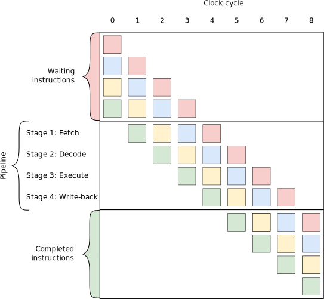
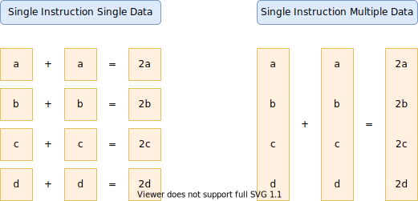
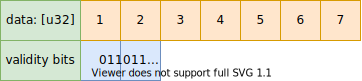
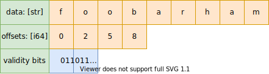
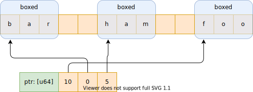
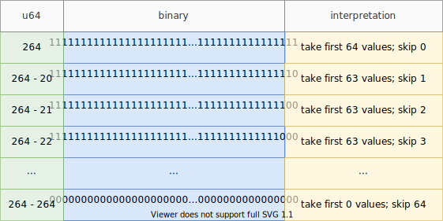
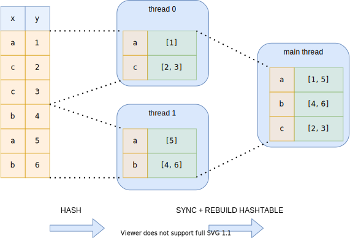
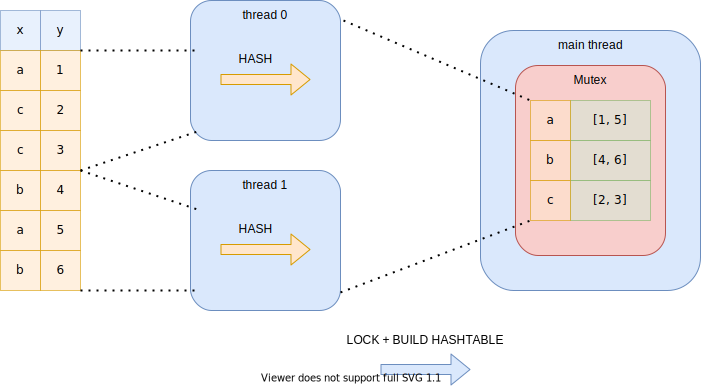
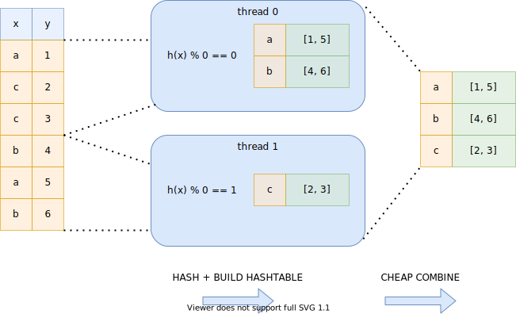

# I wrote one of the fastest DataFrame libraries (Polars)

At the time of writing this, the coronavirus has been in our country for a year, which means I have been sitting at home for a very long time.
At the start of the pandemic, I had a few pet projects in Rust under my belt and I noticed that the _are we DataFrame yet_ wasn't anywhere near my satisfaction.
So I wondered if I could make a minimalistic crate that solved a specific use case of mine.
But boy, did that get out of hand. 

A year later, and with lots of programming, comes one of the fastest DataFrame libraries available out there.
This is my first official `hello world` from [Polars](https://github.com/pola-rs/polars) (copied over from my [personal blog](https://www.ritchievink.com/)).
With this post, I hope I can take the reader along with some design decisions I encountered and get a more thorough understanding of how Polars works under the hood.

## Quite a bold claim

I know it is quite a bold claim to make, and I would not make it lightly.
There is a benchmark for database systems that does a benchmark on in-memory tools ran by H2O.ai.
This benchmark consists of ten groupby tests on different data cardinalities and query complexity to give a well-rounded view of a tool performance, and five tests on different join questions.
At the time of writing this blog, Polars is the fastest DataFrame library in the benchmark, second to R [data.table](https://cran.r-project.org/web/packages/data.table/); and Polars is in the Top 3 all tools considered.

Below are shown the summaries of the 5GB dataset test, and you can see the whole updated benchmark [here](https://h2oai.github.io/db-benchmark/).

* **Join** on 100k rows, 7 columns:

| Package | Version | Release date | Time [s] |
| :-- | :-- | :-- | --: |
| data.table | 1.14.1 | 2021/02/21 | 86 |
| Polars | 0.6.5 | 2021/02/25 | 125 |
| Spark | 3.0.2 | 2021/02/21 | 509 |
| Pandas | 1.1.5 | 2021/01/02 | 746 |

* **Basic groupdby** on 100k rows, 9 columns:

| Package | Version | Release date | Time [s] |
| :-- | :-- | :-- | --: |
| data.table | 1.14.1 | 2021/02/21 | 16 |
| Polars | 0.6.5 | 2021/02/25 | 29 |
| Spark | 3.0.2 | 2021/02/21 | 35 |
| Pandas | 1.1.5 | 2021/01/02 | 87 |

* **Advanced groupdby** on 100k rows, 9 columns:

| Package | Version | Release date | Time [s] |
| :-- | :-- | :-- | --: |
| data.table | 1.14.1 | 2021/02/21 | 110 |
| Polars | 0.6.5 | 2021/02/25 | 153 |
| Spark | 3.0.2 | 2021/02/21 | - |
| Pandas | 1.1.5 | 2021/01/02 | 780 |

**Update 2021/03/14:** benchmarks age poorly, Polars now has the fastest join algorithm in the benchmark!

## Know your hardware

If you want to design for optimal performance you cannot ignore hardware.
There are cases where algorithmic complexity doesn't give you a good intuition of the real performance due to hardware-related issues like cache hierarchies and branch prediction.
For instance, up to a certain number of elements (a few hundreds, depending on the datatype), it is faster to lookup a given element in an array than to look it up in hashmap, whereas the time complexity of those data structures are $\mathcal{O}(n)$, and $\mathcal{O}(1)$ respectively. 
This makes design decisions also very temporal, what is a bottleneck today may not be in the future.
This is clearly seen in database systems.
The previous generation of these latter, PostgreSQL or MySQL for instance, are all row-based volcano models[^1], an excellent design decision in that era when disks were much slower and RAM was very limited.
Nowadays we have fast SSD disks and large amounts of memory available, and wide SIMD registers, we see that columnar databases like CockroachDB or DuckDB are among the best performing DBMS.

[^1]: Goetz Graefe: *Volcano: an extensible and parallel query evaluation system* (1994, [IEEE Trans. Knowl. Data Eng.](https://paperhub.s3.amazonaws.com/dace52a42c07f7f8348b08dc2b186061.pdf)).

### Cache hierarchies

Oversimplifying, RAM comes in two flavors, large and slow or fast and small.
For this reason, you have memory caches in a hierarchy.
You've got main memory that is large and slow.
And memory you've used last is stored in L1, L2, L3 cache with more latency respectively.
The summation below gives you an idea of the relative latencyi (access time in CPU cycles) of the different cache levels:

* CPU register: 1 cycle
* L1 cache: ~1-3 cycles
* L2 cache: ~10 cycles
* L3 cache: ~40 cycles
* Main memory: ~100-300 cycles

When accessing data sequentially we want to make sure that data is in cache as much as possible, or we could easily have a ~100x performance penalty.
Caches are loaded and deleted in cache lines.
When we load a single data point, we get a whole cache line, but we also remove a whole cache line.
They are typically 64, or 128 bytes long and aligned on 64 bytes memory adresses.

### Prefetching and branch predictions

CPUs prefetch data and instructions to a local cache to reduce the high penalty of memory latency.
If you have a tight loop without any branches (if-else-then structures) the CPU has no problem knowing which data to prefetch and can fully utilize [instruction pipelines](https://en.wikipedia.org/wiki/Instruction_pipelining). 

Instruction pipelines hide latency by doing work in parallel.
Every CPU instruction goes through a fetch-decode-execute-write-back sequence.
Instead of doing these four instructions sequentially in a single pipeline, there are multiple pipelines that already pre-fetch (decode, execute, _etc._) the next instructions.
This increases throughput and hides latency.
However, if this process is interrupted, you start with empty pipelines and you have to wait the full latency period for the next instruction.
Below a visual of instruction pipelines:

The CPU does its best to predict which conditional jump is taken and speculatively execute that code in advance (_i.e._, keep the pipelines filled), but if it has mispredicted it must clear that work and we pay the latency price until the pipelines are full again. 

### SIMD instructions

Modern processors have SIMD registers ([Single Instruction Multiple Data](https://en.wikipedia.org/wiki/SIMD)) which operate on whole vectors of data in a single CPU cycle.
The vector lane widths vary from 128 bits to 512 bits, and the speedup depends on the width of the registers and the number of bits needed to represent the datatype.
These registers greatly improve the performance of simple operations if you can fill them fast enough (linear data).
A columnar memory format can therefore fully utilize SIMD instructions.
Polars and its memory backend [Arrow](https://arrow.apache.org/), utilize SIMD to get optimal performance.

## Arrow memory format

Polars is based on the [safe Arrow2 implementation](https://github.com/jorgecarleitao/arrow2) of the [Apache Arrow specification](https://arrow.apache.org/docs/format/Columnar.html).
Arrow can be seen as middleware software for DBMS, query engines and DataFrame libraries.
It provides very cache-coherent data structures and proper missing data handling.

Let's go through some examples to see what this means for Polars.

### Arrow numeric array

An Arrow numeric array consists of a data buffer containing some typed data, _e.g._ `f32`, `u64`, _etc._, shown in the figure as an orange colored array.
Besides the value data, an Arrow array always has a validity buffer.
This buffer is a bit array where the bits indicate missing data.
Because the missing data is represented by bits there is minimal memory overhead.

This directly shows a clear advantage over [Pandas](https://pandas.pydata.org/) for instance, where there is no clear distinction between a float `NaN` and missing data, where they really should represent different things. 

### Arrow string array

The figure below shows the memory layout of an Arrow `LargeString` array.
This figure encodes the following array `["foo", "bar", "ham"]`.
The Arrow array consists of a data buffer where all string bytes are concatenated to a single sequential buffer (good for cache coherence!).
To be able to find the starting and ending position of a string value there is a separate offset array, and finally, there is the null-bit buffer to indicate missing values.

Let's compare this with a pandas string array.
Pandas strings are actually Python objects, therefore they are boxed (which means there is also memory overhead to encode the type next to the data).
Sequential string access in pandas will lead to cache miss after cache miss, because every string value may point to a completely different memory location. 

For cache coherence, the Arrow representation is a clear winner.
However, there is a price.
If we want to filter this array or we want to take values based on some index array we need to copy a lot more data around.
The pandas string array only holds pointers to the data and can cheaply create a new array with pointers.
Arrow string arrays have to copy all the string data, especially when you have large string values this can become a very large overhead.
It is also harder to estimate the size of the string data buffer, as this comprises the length of all string values. 

Polars also has a `Categorical` type which helps you mitigate this problem.
Arrow has a solution for this problem, called the `Dictionary` type, which is similar to Polars `Categorical` type.

### Reference counted

Arrow buffers are reference counted and immutable.
Meaning that copying a DataFrame, Series, Array is almost a no-op, making it very easy to write purely functional code.
The same counts for slicing operations, which are only an increment of the reference count and a modification of the offset.

### Performance: Missing data and branching

As we have seen, the missing data is encoded in a separate buffer.
This means we can easily write branchless code by just ignoring the null-bit buffer during an operation.
When the operation is finished the null-bit buffer is just copied to the new array.
When a branch miss would be more expensive than the execution of an operation this is an easy win and used in many operations in Arrow and Polars.

### Performance: filter-trick

An operation that has to be done often in a DBMS is filtering.
Based on some predicate (boolean mask) we filter rows.
Arrow null-bit buffer allow for very fast filtering using a **filter-trick** (unofficially coined by yours truly; _credits for the filter-trick go the Apache Arrow implementation_).
Note this filter-trick often leads to faster filters, but it may not always be the case.
If your predicate consists of alternating boolean values, _e.g._, `[true, false, true, false, ... , true, false]` this trick has a slight overhead. 

The core idea of the filter-trick is that we can load the bit array from memory as any integer type we want.
Let's say that we load the bit array as an unsigned integer `u64` then we know that the maximum encoded value is $2^{64}$ (64 consecutive one value in binary), and the minimum encoded value is 0 (64 consecutive 0 values in binary).
We can make a table of 64 entries that represent how many consecutive values we can filter and skip.
If this integer is in this table we know have many values to filter in very few CPU cycles and can do a `memcpy` to efficiently copy data.
If the integer is not present in the table we have to iterate through the bits one by one and hope for a hit in the following 64 bits we load.

This filter-trick is used of course in any operation that includes a predicate mask, such as `filter`, `set`, and `zip`.

## Parallelization

With the plateauing of CPU clock speeds and the end of Moore's law in sight, the free lunch[^2] is over.
Single-threaded performance isn't going to increase much anymore.
To mitigate this, almost all hardware nowadays has multiple cores.
My laptop has 12 logical cores, so there is a tremendous potential for parallelization.
Polars is written to exploit parallelism as much as possible. 

[^2]: Herb Sutter: *The Free Lunch Is Over: A Fundamental Turn Toward Concurrency in Software* (2005, [weblog](http://www.gotw.ca/publications/concurrency-ddj.htm)).

### Embarrasingly parallel

The best parallelization is of course where is no need for communication and there are no data dependencies.
Polars utilizes this kind of parallelism as much as possible. 
This is for instance the case if we do an aggregation on the columns in a DataFrame.
All columns can be aggregated on in parallel.
Another embarrassingly parallel algorithm in Polars in the apply phase in a groupby operation.

### Parallel hashing

Hashing is the core of many operations in a DataFrame library, a groupby operation creates a hash table with the group index pointers, and a join operation needs a hash table to find the tuples mapping the rows of the left to the right DataFrame. 

#### Expensive synchronization

In both operations, we cannot simply split the data among the threads.
There is no guarantee that all the same keys would end up in the same hash table on the same thread.
Therefore we would need an extra synchronization phase where we build a new hashtable.
This principle is shown in the figure below for two threads.

#### Expensive locking

Another option that is found too expensive is hashing the data on separate threads and have a single hash table in a `mutex`.
As you can imagine, thread contention is very high in this algorithm and the parallelism doesn't really pay of.

#### Lock-free hashing

Instead of the before mentioned approaches, Polars uses a lock-free hashing algorithm.
This approach does do more work than the previous [expensive locking approach](#expensive-locking), but this work is done in parallel and all threads are guaranteed to not have to wait on any other thread.
Every thread computes the hashes of the keys, but depending on the outcome of the hash, it will determine if that key belongs to the hash table of that thread.
This is simply determined by the `hash value % thread number`.
Due to this simple trick, we know that every threaded hash table has unique keys and we can simply combine the pointers of the hash tables on the main thread.

## Query optimization: less is more

The best performance gains are simply not doing any work at all.
Polars consists of two public APIs, one that is eager, procedural programming, and one that is lazy declarative programming.
I would recommend using the lazy API as much as possible when dealing with performance-critical code. 

The declarative DSL allows Polars to analyze a logical plan of your query and it can apply several optimization/heuristics such that your query can be executed by just doing less work.

If you want to read more about the optimizations that are done to the query plan, there is a [section with examples in the Polars Book](https://ritchie46.github.io/polars-book/lazy_polars/predicate_pushdown.html).

## And more

This post only highlighted a few of the performance related designs in the Polars and Arrow library.
Other things that are implemented are for instance:

* Ad-hoc partitioning (map-reduce like `groupby`s).
* [Vectorized hashing](https://www.cockroachlabs.com/blog/vectorized-hash-joiner/)[^3] (tipped by [Daniël Heres](https://github.com/Dandandan)).
* Using table statistics to choose fast paths.
* And so much more...

Now, the `hello world` is officially out there.
I may highlight those other subjects in later posts.

But for now check out [Polars on GitHub](https://github.com/ritchie46/polars), and if you have any remarks, feature requests, _etc._ let me know!

[^3]: Angela Chang: *CockroachDB - 40x faster hash joiner with vectorized execution* (2019, [weblog](https://www.cockroachlabs.com/blog/vectorized-hash-joiner/)).
