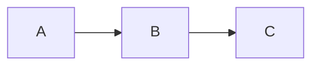
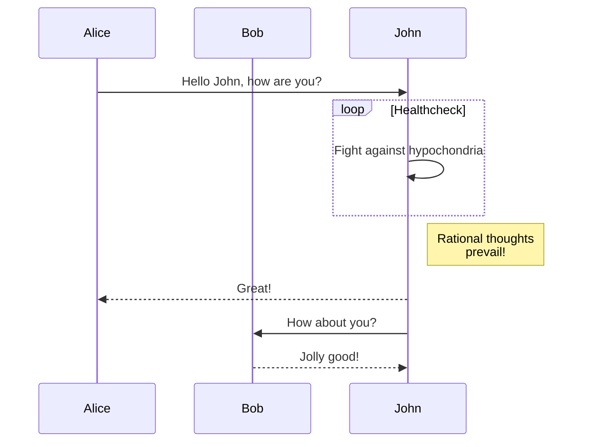

# Contribution guide and sample ground

To contribute, **create a new folder** named after today's date in the `YYYYMMDD/` format
within the `www/posts/` filetree present in a branch of your own
[forked](https://docs.github.com/en/get-started/quickstart/fork-a-repo) version of the
[`polars-web`](https://github.com/pola-rs/polars-web) repo. Write your post in the
**Markdown format**, in a file called `index.md`. Put all the necessary images in the
same folder (use a relative path when including them). Send us a Pull Request once
satisfied with your production!

When building the list of posts we use the **front matter content** to define title,
author(s), _etc._ Start your `index.md` with:

```text
---
title: My Polars contribution
tldr: A quick description of the post that can span multiple lines (note the
      indentation) but cannot include Markdown shenanigans.
authors: GitHub nickname, full name, supervillain handle we do not judge
link: GitHub page, personal blog, random Rick Astley song
---

# Polars is breathtaking, the story of my realisation
```

The content of the `title` field will be used to redirect to the post itself, and the
`link` will be the target of the link the `authors` text will be point to. The `tldr`
spiel, if present, will be used as "motivational blurb" for readers to get interested.

Note that without those information the **blog post will not be listed**, and will not
be accessible for our readers!

The rest of this page stands as an example of supported Markdown-to-HTML processing, and
the final look and feel. The rendering itself is done via
[`Python-Markdown`](https://python-markdown.github.io/), with plenty added extensions to
deal with the fancy stuff (if you need something extra let's discuss it in the PR):

* [`DeleteSubExtension`](https://facelessuser.github.io/pymdown-extensions/extensions/tilde/)
  to introduce crossed out and subscript text.
* [`FootnoteExtension`](https://python-markdown.github.io/extensions/footnotes/) to
  handle, well, footnotes.
* [`HighlightExtension`](https://facelessuser.github.io/pymdown-extensions/extensions/highlight/)
  to single out code blocks.
* [`InsertSupExtension`](https://facelessuser.github.io/pymdown-extensions/extensions/caret/)
  to introduce underlined and superscript text.
* [`MarkdownInHtmlExtension`](https://python-markdown.github.io/extensions/md_in_html/)
  to parse and render Markdown located *within* HTML blocks.
* [`SuperFencesCodeExtension`](https://facelessuser.github.io/pymdown-extensions/extensions/superfences/)
  to enhance the processing of fenced blocks.
* [`TableExtension`](https://python-markdown.github.io/extensions/tables/) to render
  tables.

Once generated, some extra rendering is done in the browser -*i.e.*, on the client- via
a couple `JavaScript` libraries:

* [`highlight.js`](https://highlightjs.org/) for syntax highlighting.
* [`KaTeX`](https://katex.org/) to render equations written in LaTeX.
* [`Mermaid`](https://mermaidjs.github.io/) to render diagrams and flowcharts.

The styling is stored in the [`style-post.css`](/style-post.css) file. It is however
**allowed to custom** them styles by adding a `style.css` file in the folder containing
the `Markdown` post to render.

Decision has been made to keep a **light theme** for all posts to accomodate for
contributed content with white background.

Note that if you follow the steps indicated in the main repo, and `Docker` helping, you
should be able to render it locally to have a look at your post as it will appear to
any reader.

# Blockquotes

Napoleon alledgedly said:

```markdown
> Un bon croquis vaut mieux qu'un long discours.
```

> Un bon croquis vaut mieux qu'un long discours.

# Emphasis

## General

```markdown
*This text should be italic.* _This should also be italic._

**This text should be bold.** __This should also be bold.__

^^This text should be underlined.^^

~~This text should be crossed out.~~

_One **can** ^^combine^^ all ~~those~~._
```

*This text should be italic.* _This should also be italic._

**This text should be bold.** __This should also be bold.__

^^This text should be underlined.^^

~~This text should be crossed out.~~

_One **can** ^^combine^^ all ~~those~~._

## Sub-/super-script

```markdown
H~2~O

Copyright^©^
```

H~2~O

Copyright^©^

# Equations

Rendered in the browser via [`KaTeX`](https://katex.org/). `$$` and `$` notations are supported.

## Block

```markdown
$$E = m \, c^{2}$$

$$f(x) = \int_{-\infty}^{\infty} \hat{f}(\xi) \, e^{2 \pi i \xi x} \, d\xi$$
```

$$E = m \, c^{2}$$

$$f(x) = \int_{-\infty}^{\infty} \hat{f}(\xi) \, e^{2 \pi i \xi x} \, d\xi$$

## Inline

```markdown
And here is an inline equation: $2 \pi i \xi x$.
```

And here is an inline equation: $2 \pi i \xi x$.

# Footnotes

Napoleon alledgedly said[^1]:

[^1]: [I did not invent it.](https://en.wikipedia.org/wiki/A_picture_is_worth_a_thousand_words#Equivalents)

```markdown
Napoleon alledgedly said[^1]:

[^1]: Footnote content.
```

> Un bon croquis vaut mieux qu'un long discours.

# Images

```markdown

```


# Inline code

```markdown
Inline code blocks such as `import polars as pl` are not highlighted.
```

Inline code blocks such as `import polars as pl` are not highlighted.

# Links

```markdown
[`Polars` organization](https://github.com/pola-rs)
```

[`Polars` organization](https://github.com/pola-rs)

# Lists

## Unordered list

```markdown
* Item
* Item
    * Subitem
    * Subitem
```

* Item
* Item
    * Subitem
    * Subitem

## Ordered list

```markdown
1. Item 1
1. Item 2
    1. Item 2a
    1. Item 2b
```

1. Item 1
1. Item 2
    1. Item 2a
    1. Item 2b

# Markdown in HTML

````markdown
<details markdown="1">
<summary markdown="1">Test with `code`.</summary>

**This is bold**, ^^this is underlined^^. [This is a link](https://calmcode.io/).

```python
import polars as pl
```

</details>
````

* Note the `markdown="1"` attribute to make sure the content inside those tags is being parsed
  and converted properly.
* Mind the necessary spaces:
    - After the `<summary>...</summary>` line.
    - Before the closing `</details>` tag.

<details markdown="1">
<summary markdown="1">Test with `code`.</summary>

**This is bold**, ^^this is underlined^^. [This is a link](https://calmcode.io/).

```python
import polars as pl
```

</details>

# Mermaid diagram

Rendered in the browser via [`Mermaid`](https://mermaidjs.github.io/).

````markdown

````


And a more complicated one from the official website:



Check [this page](https://mermaid-js.github.io/mermaid/#/theming) to style diagrams.

# Syntax highlighting

Rendered in the browser via [`highlight.js`](https://highlightjs.org/).

````markdown
```python
import polars as pl

q = (
    pl.scan_csv("iris.csv")
    .filter(pl.col("sepal_length") > 5)
    .groupby("species")
    .agg(pl.all().sum())
)

df = q.collect()
```
````

```python
import polars as pl

q = (
    pl.scan_csv("iris.csv")
    .filter(pl.col("sepal_length") > 5)
    .groupby("species")
    .agg(pl.all().sum())
)

df = q.collect()
```

# Tables

```markdown
First Header | Second Header
------------ | -------------
Content from cell 1 | Content from cell 2
Content in the first column | Content in the second column
$2 \pi r^{2}$ | With inline equation
```

First Header | Second Header
------------ | -------------
Content from cell 1 | Content from cell 2
Content in the first column | Content in the second column
$2 \pi r^{2}$ | With inline equation

# Title

Using the `#` to `######` notation.

## Subtitle

Text

### Section

Text

#### Subsection

Text

##### Paragraph

Text

###### Subparagraph

Text
